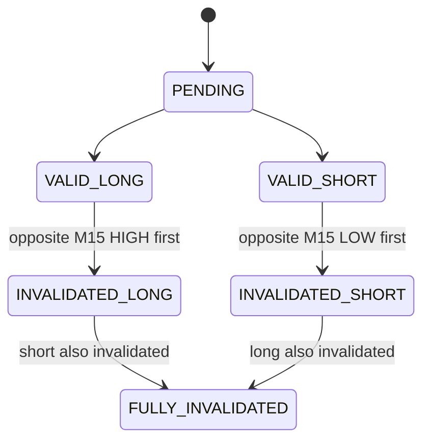

# Strategy 2 Hard Invalidation State Machine

## Context

Manual screenshots revealed deterministic invalidation behavior: the first M15 liquidity side taken inside the active H1 context can invalidate the opposite directional setup. Strategy 2 appears more mechanically structured than previously assumed.

## Core Rule

- LONG targeting H1 LOW becomes invalid when the opposite M15 HIGH is taken first.
- SHORT targeting H1 HIGH becomes invalid when the opposite M15 LOW is taken first.

## Sticky Invalidation

Once a direction is invalidated inside an active H1 context, it cannot reactivate later in the same H1 context. Reactivation attempts are logged and blocked.

## State Machine

## Layer Separation

- Layer A: hard mechanical validity, H1 reference, H1 liquidity side, M15 order-of-liquidity-taken, sweep validity, MAE reached.
- Layer B: behavioral quality, reclaim quality, compression, acceleration, energy state, move consumed, clean vs dirty.

This branch formalizes Layer A only. It does not derive behavioral quality automatically.

## Results

- samples processed: `1089`
- VALID_LONG: `99`
- VALID_SHORT: `87`
- INVALIDATED_LONG: `315`
- INVALIDATED_SHORT: `332`
- FULLY_INVALIDATED: `256`
- reactivation blocked: `903`

## Honest Limitations

- No behavioral quality derivation.
- No edge claim.
- No profitability analysis.
- No signal generation.
- Still research-only.

## Verdict Flags

- `HARD_INVALIDATION_LAYER_FORMALIZED`
- `M15_SEQUENCE_LOGIC_STRENGTHENED`
- `INVALIDATION_STICKY_RULE_IMPLEMENTED`
- `BEHAVIORAL_LAYER_NOT_YET_DERIVED`
- `STRATEGY_2_REMAINS_RESEARCH_ONLY`
- `NO_DEPLOYMENT_DECISION`
